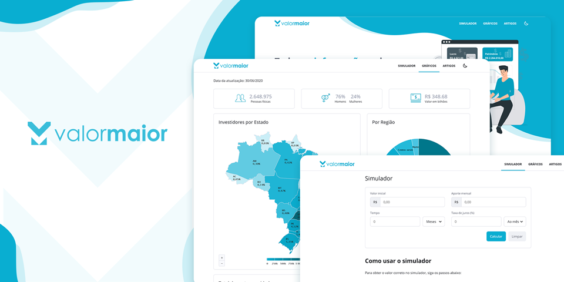

# valormaior

  

  
   
  
  
  

## About

This is a front-end private project created for the company ValorMaior
Project created using NextJs to take the advantage of Search Engine Optimization, Server Side Rendering and Static Site GenerationG

## Status

It still under development, but you can check the preview at [Valor Marior](https://valormaior.now.sh/)
